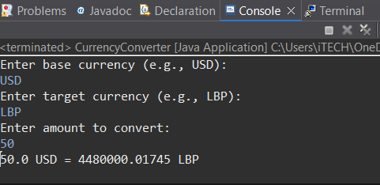
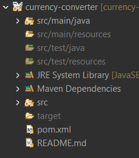
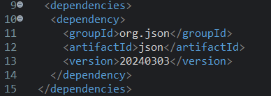
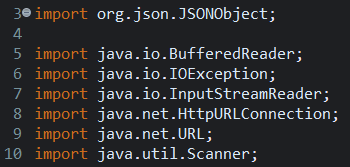

# Currency-Converter
📌 Project: Real-Time Currency Converter

--------

💡 Description

A simple Java console application that converts currencies using real-time exchange rates from CurrencyLayer. It prompts the user to enter the source currency, target currency, and amount, then displays the converted amount using live data.

--------

🖼️ Screenshots
Screenshot of the running program in Eclipse console (user input + result).

Screenshot of the Eclipse project structure.

A picture of the pom.xml with dependencies.

Libraries used.

--------

🛠️ Technologies Used

Java

Maven

CurrencyLayer API

org.json (for parsing JSON)

--------

🛡️ Error Handling

- Handles invalid inputs (like text instead of a number).

- Catches failed API calls or network issues.

- Prompts the user again if incorrect data is entered.

--------

🚀 How to Run

⚠️ Eclipse is required unless you're using another IDE or compiling via terminal.

Clone the repository: git clone https://github.com/rajaashb/Currency-Converter.git

Open the project in Eclipse.

Make sure Maven dependencies are installed (especially org.json).

Run the CurrencyConverter.java file.

